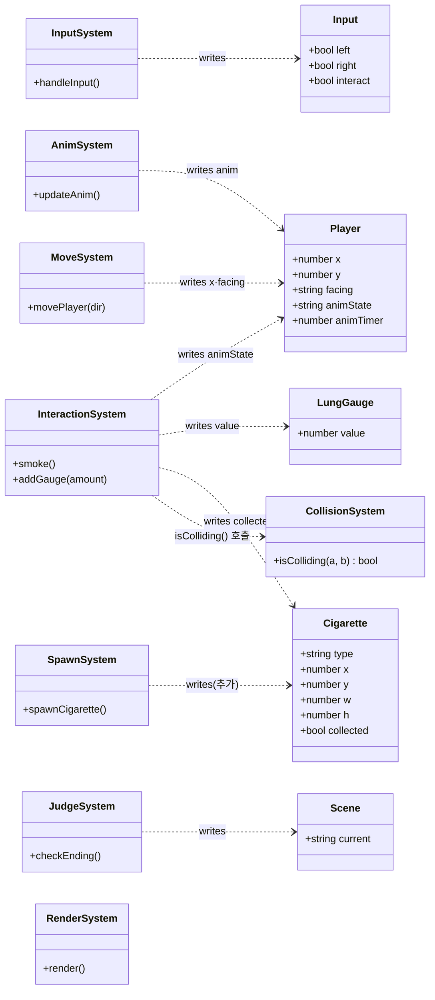
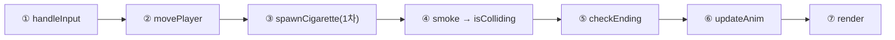

# 담배 줍기 게임 — 클래스 & 시스템 레퍼런스

> 팀 공용 참조 문서. 코딩은 이 문서를 기준으로 합니다.

| 항목   | 값                                                  |
| ------ | --------------------------------------------------- |
| 스코프 | 0차(이동·줍기·게이지) + 1차 일부(S/M/L·피우기 애니) |
| Status | **DRAFT** (확정되면 → APPROVED)                     |
| Date   | 2026-06-08                                          |

### 읽는 법 (5초)

- **DATA** = 정적(플레이 중 안 변함). **STATE** = 런타임(변함).
- 다이어그램 **화살표 = 쓰기(writes)·호출(calls)만** 표시. _읽기(reads)는 함수 표에서 확인._
- 🔒 **트랜잭션** = 여러 상태를 all-or-nothing으로 바꾸는 함수. (이 게임엔 `smoke()` 하나)
- `render()`에 화살표(쓰기)가 **없는 게 정상** — 렌더는 읽기 전용.

---

## 1. 구조 다이어그램 (클래스 · 필드 · 함수 · 쓰기/호출)

**한눈 요약:** 데이터 클래스 5개(Player·Cigarette·LungGauge·Scene·Input) + 시스템 8개. 데이터를 2개 이상 묶어 바꾸는 곳은 `smoke()` 하나뿐(🔒).

## 2. 실행 순서 (play 씬 루프)

> 실제 루프 최상단에는 `switch(scene)` 분기가 있고, 위 7줄은 `scene === 'play'` 분기 안에서만 돕니다. title·intro·ending에선 각 화면의 입력 + 렌더(+intro 타이머)만 돕니다.

---

## 3. 클래스별 상세

### Player (player)

**DATA.PLAYER** — 정적 설정

| 속성  | 값  | 도메인 | 설명            |
| ----- | --- | ------ | --------------- |
| w     | 24  | >0     | 충돌 박스 너비  |
| h     | 32  | >0     | 충돌 박스 높이  |
| speed | 3   | >0     | 프레임당 이동량 |

**STATE.player** — 런타임 (단일 인스턴스)

| 필드      | 타입                               | 정적/런타임  | 초기값         | 설명                                                                                   |
| --------- | ---------------------------------- | ------------ | -------------- | -------------------------------------------------------------------------------------- |
| x         | number                             | 런타임       | 필드 중앙 바닥 | 좌우 위치                                                                              |
| y         | number                             | 런타임(고정) | 바닥 y         | 이번 스코프 고정                                                                       |
| facing    | `'left' \| 'right'`                | 런타임       | `'right'`      | 바라보는 방향                                                                          |
| animState | `'idle' \| 'picking' \| 'smoking'` | 런타임       | `'idle'`       | 행동 상태 (플레이어 FSM)                                                               |
| animTimer | number                             | 런타임       | 0              | smoking 잔여 프레임. `smoke()`에서 `DATA.SMOKE_FRAMES`로 세팅, `updateAnim()`에서 감소 |

### Cigarette (cigarette)

**DATA.CIG_TYPES** — type별 정적 값

| type | score | w   | h   | sprite |
| ---- | ----- | --- | --- | ------ |
| S    | 10    | 16  | 16  | cig_s  |
| M    | 20    | 16  | 16  | cig_m  |
| L    | 30    | 16  | 16  | cig_l  |

**STATE.cigarettes[]** — 런타임 (인스턴스 배열)

| 필드      | 타입                | 정적/런타임          | 초기값·생성처            | 설명                        |
| --------- | ------------------- | -------------------- | ------------------------ | --------------------------- |
| type      | `'S' \| 'M' \| 'L'` | 런타임(생성 후 고정) | spawn 시 결정            | 종류                        |
| x         | number              | 런타임               | spawn 시 배치            | 위치                        |
| y         | number              | 런타임               | spawn 시 배치            | 위치                        |
| w, h      | number              | 런타임(고정)         | `= DATA.CIG_TYPES[type]` | 히트박스                    |
| collected | bool                | 런타임               | `false`                  | 피워졌으면 true → 렌더 제외 |

### LungGauge (lungGauge)

**DATA** — `GAUGE_MAX = 100` (최대치 / 엔딩 임계값)

**STATE.lungGauge**

| 필드  | 타입   | 정적/런타임 | 초기값 | 설명                                             |
| ----- | ------ | ----------- | ------ | ------------------------------------------------ |
| value | number | 런타임      | 0      | 도메인 `[0, GAUGE_MAX]`. `addGauge()`에서만 변경 |

### Scene (scene)

**STATE.scene**

| 필드    | 타입                                       | 정적/런타임 | 초기값    | 설명                       |
| ------- | ------------------------------------------ | ----------- | --------- | -------------------------- |
| current | `'title' \| 'intro' \| 'play' \| 'ending'` | 런타임      | `'title'` | 화면 FSM. 루프 분기를 지배 |

### Input (input)

**DATA.KEYS** — 키 바인딩

| 동작     | 키           |
| -------- | ------------ |
| interact | `'E'`        |
| left     | `'←'`, `'A'` |
| right    | `'→'`, `'D'` |

**STATE.input**

| 필드     | 타입 | 정적/런타임 | 초기값 |
| -------- | ---- | ----------- | ------ |
| left     | bool | 런타임      | false  |
| right    | bool | 런타임      | false  |
| interact | bool | 런타임      | false  |

---

## 4. 함수(시스템) 레퍼런스

| 함수                | 시스템    | 읽기(reads)                                        | 쓰기(writes)                                     | 🔒  | 설명                                                          |
| ------------------- | --------- | -------------------------------------------------- | ------------------------------------------------ | --- | ------------------------------------------------------------- |
| `handleInput()`     | 입력      | 키 입력                                            | input                                            |     | 키 상태를 input 플래그로 옮김                                 |
| `movePlayer(dir)`   | 이동      | input, player, DATA.PLAYER                         | player.x, player.facing                          |     | x를 `speed·dir`만큼 이동 후 `[0, fieldW−w]` clamp; facing=dir |
| `spawnCigarette()`  | 생성(1차) | DATA.CIG_TYPES, 난수/타이머                        | cigarettes[]                                     |     | 새 담배 인스턴스 추가                                         |
| `isColliding(a, b)` | 충돌 판정 | a·b의 x/y/w/h                                      | (없음)                                           |     | 두 박스 AABB 겹침 → bool. **순수 함수**                       |
| `smoke()`           | 상호작용  | input.interact, player, cigarettes, DATA.CIG_TYPES | cigarette.collected, lungGauge, player.animState | 🔒  | 겹친 담배를 피움. 아래 트랜잭션 블록 참조                     |
| `addGauge(amount)`  | 상호작용  | lungGauge, DATA.GAUGE_MAX                          | lungGauge                                        |     | 게이지 증가 후 `[0,100]` clamp                                |
| `updateAnim()`      | 애니      | player.animState, player.animTimer                 | player.animState, player.animTimer               |     | animTimer 감소 → 0이면 `smoking → idle` 복귀                  |
| `checkEnding()`     | 판정      | lungGauge, DATA.GAUGE_MAX                          | scene                                            |     | `lungGauge >= MAX`면 `scene='ending'`                         |
| `render()`          | 렌더      | 전부                                               | (없음)                                           |     | 화면 그리기. **쓰기 없음 = 읽기 전용**                        |

### 🔒 `smoke()` 트랜잭션

- **사전조건:** `input.interact` && 겹친 담배 `c` 존재 && `c.collected == false` && `player.animState == 'idle'`
- **변경 순서:**
    1. `c.collected = true`
    2. `addGauge(DATA.CIG_TYPES[c.type].score)` _(→ `[0,100]` clamp)_
    3. `player.animState = 'smoking'` _(+ `animTimer = DATA.SMOKE_FRAMES`)_
- **근거:** `collected`를 **먼저** 뒤집으면, 같은 프레임 재충돌이 사전조건(`collected==false`)에서 걸려 **점수 이중 가산 불가**.
- **실패:** 사전조건 중 하나라도 거짓 → 아무 상태도 안 바꿈.

---

## 5. 보류 (미설계 / 확정 필요)

> 절차서 9·10단계에서 ❌·⚠로 남은 항목. 코딩 전 또는 1차 진입 전에 채웁니다.

| 항목                                       | 태그          | 상태                                                                                           |
| ------------------------------------------ | ------------- | ---------------------------------------------------------------------------------------------- |
| 씬 전환 함수 `startGame()` / `resetGame()` | —             | ❌ title·ending 흐름 미추출                                                                    |
| intro 사진 표시 타이밍                     | —             | ❌ intro 흐름 미추출                                                                           |
| `picking` 상태 사용 여부                   | BLOCKING      | ⚠ FSM은 `idle→picking→smoking`인데 `smoke()`는 `'smoking'` 직접 설정. picking 경유 여부 미확정 |
| `DATA.SMOKE_FRAMES` 값                     | BLOCKING      | ⚠ 애니 길이 수치 필요                                                                          |
| 담배 생성 간격 · 동시 최대 개수            | BLOCKING(1차) | ⚠ 개발문서 수치 필요                                                                           |
| S/M/L 생성 분포(비율)                      | BLOCKING(1차) | ⚠ 개발문서 수치 필요                                                                           |
| 줍힌 담배 재생성 여부                      | BLOCKING(1차) | ⚠ 미확정                                                                                       |
| 줍기 효과음                                | NON-BLOCKING  | 보류(사운드 비목표)                                                                            |
